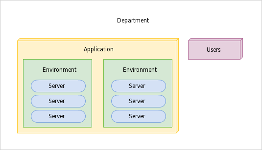

Usage
^^^^^

This article will guide you through basic usage of Gunnery.

Basic concepts
~~~~~~~~~~~~~~

To better understands how to Gunnery works lets introduce basic concepts.

.. glossary::

    Department
        Represents a dev team or company department, can have multiple applications and users assigned.

    Application
        Tasks and server environments.

    Task
        One or more commands which can be executed on any environment within application. Commands can include dynamic or user defined parameters. Every command is only executed on servers with specific role.

    Environment
        Set of related servers, every environment has a different login certificate.

    Server
        Server tagged with specific role eg. db, app, backup.

    User
        Users can only access departments which they are assigned to. Special manager role allows user to change department settings.

First steps
~~~~~~~~~~~

Follow below steps to execute first command.

1. Create application
  * Go to Settings > Applications > Create
  * After creating application you will be redirected to the new page, it will contain 2 empty lists of environments and tasks.

2. Create environment
  * Environment is used to group servers. Create first env by clicking + and entering name eg. test.

3. Create server
  * fill all required fields
  * select app role
  * copy provided SSH public key to target servers' ~/.ssh/authorized_keys file.

4. Create task
  * enter name of new command eg. process-list
  * first command eg. ps
  * assign role app to this command
  * save

5. Execute task
  * go to application page
  * click execute button located next to process-list task
  * click executed
  * you will see list of processes on target server
